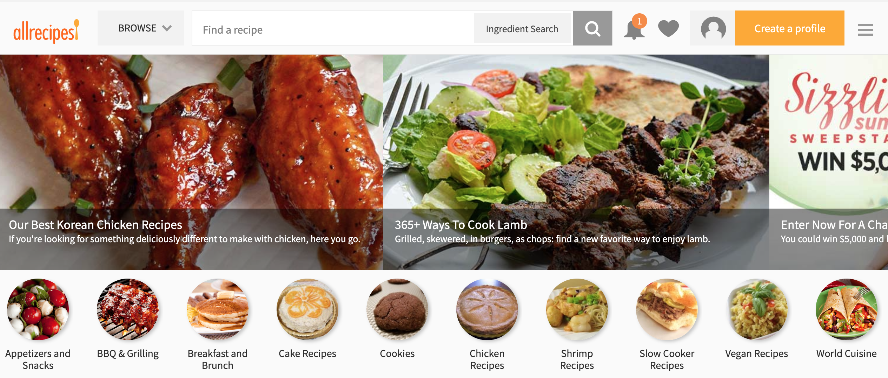

# Sound Tasty?
People need to eat, and there's so much variety in the available options! The problem is people don't always know what they like or don't like until they try it. The point of Sound Tasty is to hopefully help people find new foods they like.

## The Data
I Used Selenium to scrape around 900 recipes from Allrecipes.com, approximately 100 from each catagory.

## The Plan
To build a food recommendation system based off of flavors people like. Ask the user for ingredients they like, then find similar ingredients and recommend recipes that have those similar ingredients.

## The Preperation
I cleaned the recipe data by removing amounts and measures, cooking stop words, and some brand names. I also split the ingredients into individual words to prepare for modeling.

## The Modeling
I used Gensim to vectorize the ingredient words, then return recipes that contain ingredients with similar vectors to the input words.

## The Results
I deployed the final model to a flask app which you can find <a href=http://52.13.18.187/>here</a>.

### Next steps
The small amount of data means that there are many ingredients and recipes Sound Tasty doesn't know. The next steps would include gathering more recipes to expand it's knowledge. As well as improving the data cleaning process to allow for multi-word ingredients.
